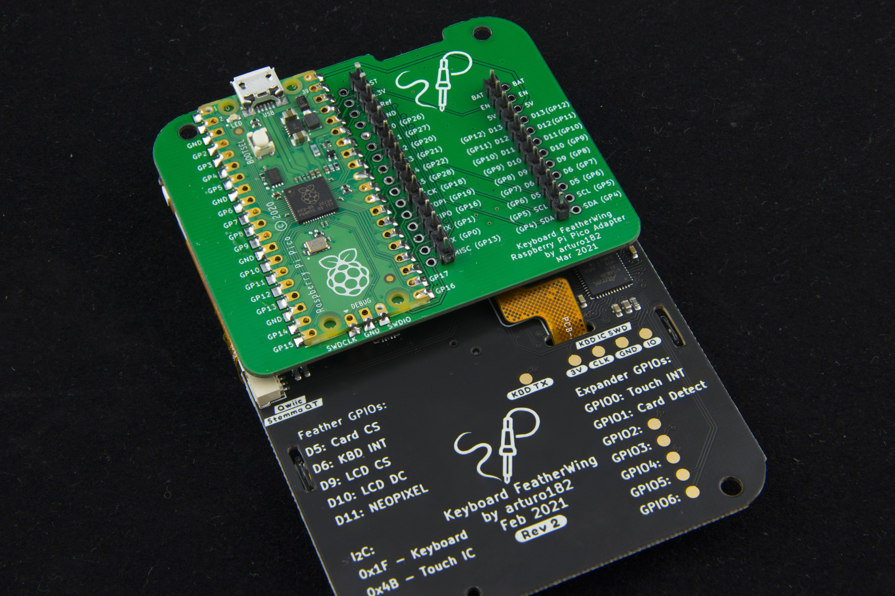

# Raspberry Pi Pico Adapter for the Keyboard FeatherWing

This adapter was designed specifically to allow driving the Keyboard FeatherWing with a Raspberry Pi Pico board.

Note: Because the Pico only has 3 analog pins, only A0, A1, and A5 of the Keyboard FeatherWing can actually be used to read analog values.

# Links

For more information visit https://kfw.solder.party/rev2/
